# Interview Cracker

Daily interview prep, modeled on LinkedIn Games. Pick the Stacks you're preparing for, such as **Agentic AI Engineer**, **Android Developer** or **Full Stack .NET Developer**. Every day you get a short Daily Challenge, and a researched Syllabus takes you through the field one Lesson at a time.

**Open the app: https://prep.chickenkiller.com**

This guide shows how to use it. How the app is built and run is in [docs/development.md](docs/development.md).

- [1. Sign up and pick your Stacks](#1-sign-up-and-pick-your-stacks)
- [2. Your home screen](#2-your-home-screen)
- [3. Play the Daily Challenge](#3-play-the-daily-challenge)
- [4. Study the Syllabus](#4-study-the-syllabus)
- [5. Practise in Review](#5-practise-in-review)
- [6. Save your grading key](#6-save-your-grading-key)
- [7. Connect your Claude](#7-connect-your-claude)
- [8. Ask for a new Stack](#8-ask-for-a-new-stack)
- [Good to know](#good-to-know)

## 1. Sign up and pick your Stacks

Open the app and choose **Sign up**. Use your email address, or your Google or GitHub account. Your first sign-in takes you to onboarding: tick one or more Stacks and save.

You can change them any time from **Stacks** in the top bar. A Stack you untick keeps your progress, so you can pick it up again later where you left off.

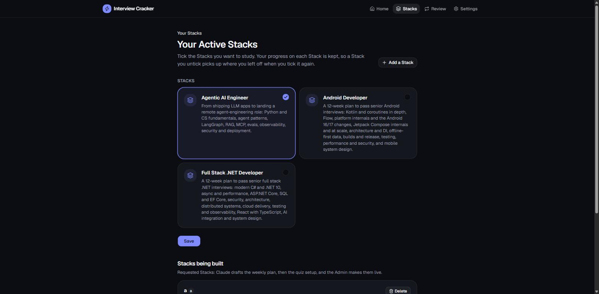

## 2. Your home screen

**Home** has a card for each Stack you study. It shows today's Daily Challenge and your Streak on that Stack. Under each card are the Stack's **Week map** and its **Archive** of past Challenges.

Below the cards are **Review**, for practising the Questions you missed, and **Catch-up**, which lists past Challenges you haven't played.

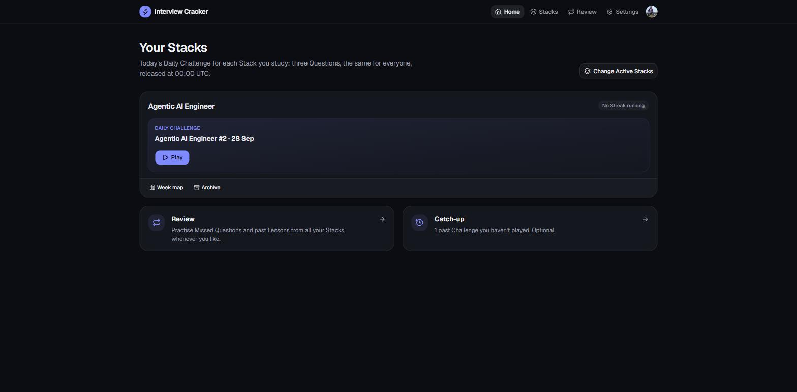

## 3. Play the Daily Challenge

Each Stack releases one numbered Daily Challenge a day at 00:00 UTC: three Questions, two multiple choice and one written. Everyone gets the same one. Choose **Play** on the home screen.

- **Only your first answer to each Question counts.** After you answer, you see the Explanation and the Sources.
- **Play today's Challenge on its Day to keep your Streak going.** Days follow UTC, so the new Challenge might arrive in your morning, your evening or at night.
- **Share how you did.** When you finish, you get a Result Card. It shows your score on each Question but not the Questions or your answers, so it's safe to share.

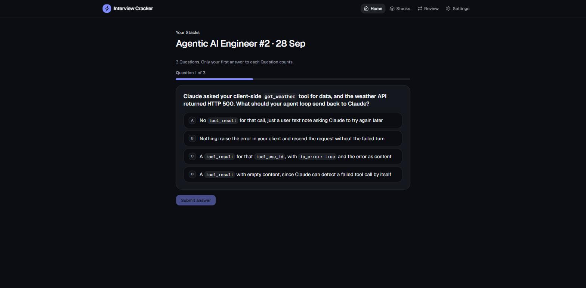

Missed a day? The Stack's **Archive** has every Challenge back to #1. A first play there is scored, but only today's Challenge counts toward your Streak.

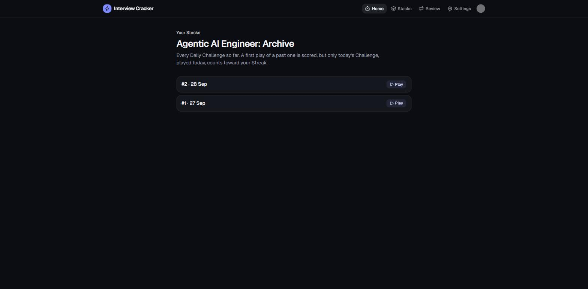

## 4. Study the Syllabus

Open a Stack from **Week map** on its home card. The top shows the Stack's summary and your progress through its Lessons.

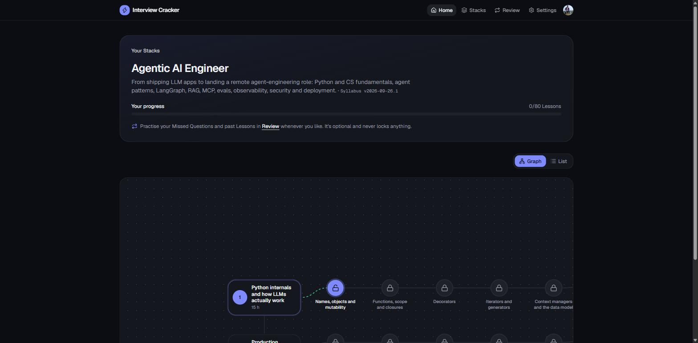

The Week map shows each Week and its Lessons, in order. The Lesson you can take now is highlighted, and the locked ones after it show a padlock. Drag to pan, and use the **+** and **−** buttons to zoom. **List** shows the same Weeks as a list, with each Week's hands-on Milestones, which you tick off yourself.

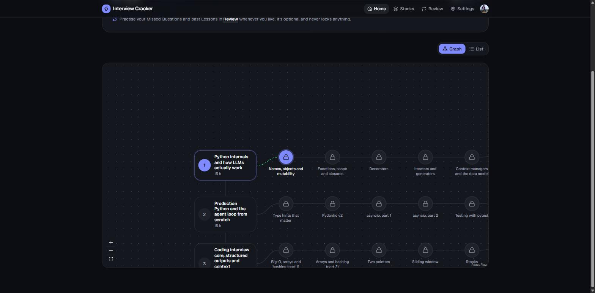

Open a Lesson to see its topics, an exercise and its Materials: free courses, docs, books and videos to learn from.

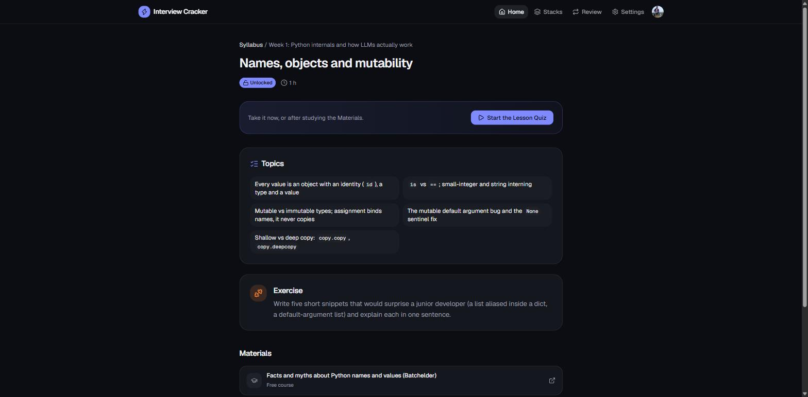

When you're ready, choose **Start the Lesson Quiz**. You can take it straight away if you already know the topic.

1. **Answer six Questions**, four multiple choice and two written.
2. **Score 80% or more to pass.** Below that, take a fresh Lesson Quiz; it skips the Questions you've already seen.
3. **Retake what you missed.** After passing, read the Explanation of each Question you missed, then answer a Retake on the same idea. When every Retake is right, the Lesson is complete and the next one unlocks.

## 5. Practise in Review

**Review** is optional practice, in sets of up to 10 Questions, across all your Stacks. The Questions you missed come first, then repeats from Lessons you've completed and Challenges you've played. A missed Question leaves Review once you've answered it correctly on three different Days. Nothing in Review can lock anything, so use it whenever you like.

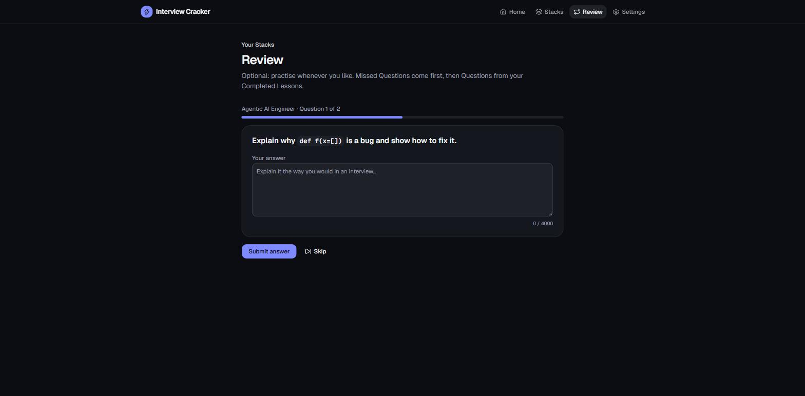

## 6. Save your grading key

Written answers are graded by an AI model, which compares your answer with a Model Answer's key points. Grading uses your own free NVIDIA API key, so **save one before you answer written Questions**. Without it, written answers can't be graded. Nothing is counted in that case, so you can submit again once the key is saved.

1. Sign in at [build.nvidia.com](https://build.nvidia.com/settings/api-keys) and choose **Generate API Key**.
2. In the app, open **Settings**, paste the key (it starts with `nvapi-`) under **Grading**, and choose **Save key**.

The key is stored encrypted and is only used to grade your answers. The app never shows it again, only its last four characters. You can replace or remove it at any time.

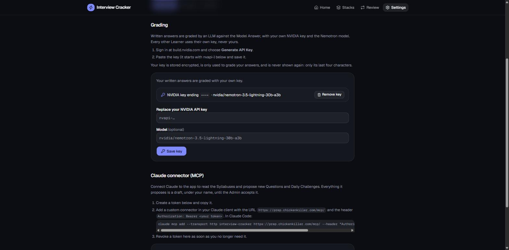

## 7. Connect your Claude

You can connect Claude (Claude Desktop, claude.ai or Claude Code) to the app. Your Claude can then read the Syllabuses, propose new Questions and Daily Challenges, and build new Stacks. Everything it proposes is a draft under your name until the Admin accepts it.

1. In **Settings**, under **Claude connector (MCP)**, type a name for the token and choose **Create token**. Copy the token: it's shown only once.
2. In your Claude app, add a custom connector with the URL `https://prep.chickenkiller.com/mcp/` and the header `Authorization: Bearer <your token>`.
   In Claude Code, run this command:

   ```bash
   claude mcp add --transport http interview-cracker https://prep.chickenkiller.com/mcp/ --header "Authorization: Bearer <your token>"
   ```

3. Revoke the token in **Settings** as soon as you no longer need it.

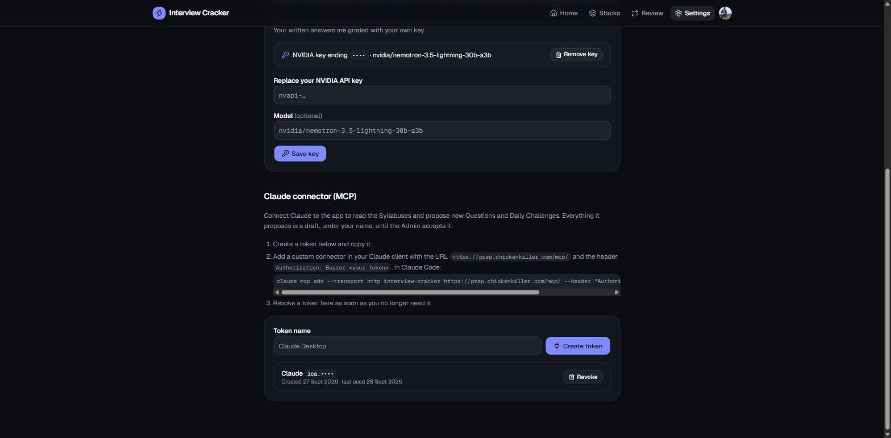

## 8. Ask for a new Stack

Don't see the role you're preparing for? On **Stacks**, choose **Add a Stack**, then say what it's for and who it's for. Add any notes and choose how many Weeks it should last.

With the connector from step 7, ask your Claude to build it. Claude researches the role, drafts the weekly plan, and then writes the Questions for every Lesson. The Admin reviews the drafts and makes the Stack live. Until then, the Stacks screen shows it under **Stacks being built**.

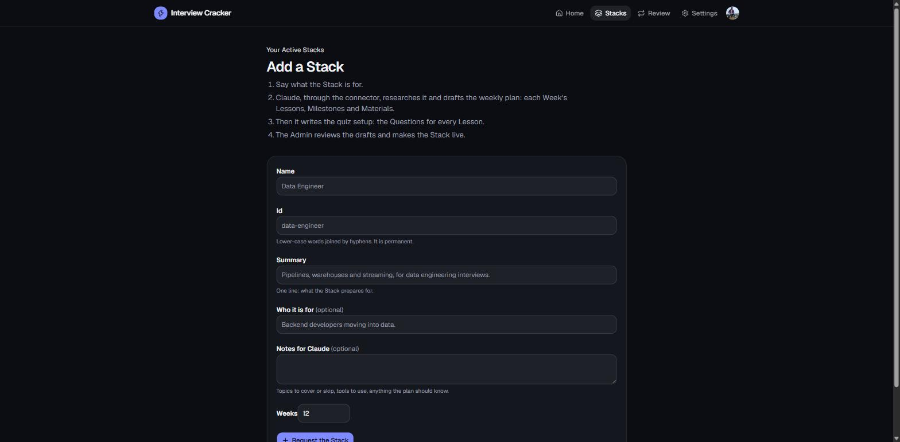

## Good to know

- **Every Day starts at 00:00 UTC**, for Daily Challenges and Streaks alike.
- **Replays are for learning only.** Playing a Challenge again changes nothing: not your score, your Streak or your missed Questions.
- **Every Question has Sources** you can check, and an Explanation shown after you answer.
- **Light or dark:** switch it under **Settings → Appearance**.
