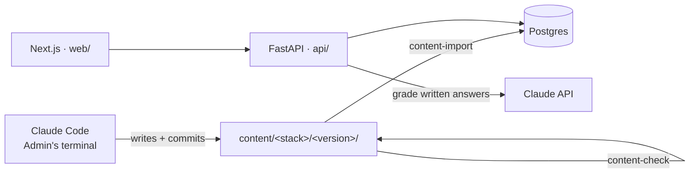

# InterviewCrackerAssistant

A self-evaluation app for interview preparation. A Learner picks a Stack, studies a Syllabus of Weekly Lessons, and proves each Lesson with a quiz before the next one unlocks. Daily Review Rounds bring Missed Questions back until they stick. The Syllabus is kept current by Claude Code, which runs in the Admin's terminal and writes reviewed, version-numbered content files.

- Glossary: [CONTEXT.md](CONTEXT.md)
- Decisions: [docs/adr/](docs/adr/)
- Plan: [docs/build-plan.md](docs/build-plan.md) (milestones, tests and demos) and [docs/implementation-order.md](docs/implementation-order.md) (ticket order)



## Repo layout

| Path | What's there |
|---|---|
| `content/schema/` | JSON Schema for `syllabus.json` and Question Bank files |
| `content/<stack>/<version>/` | One Syllabus version: `syllabus.json` plus `questions/<lesson-id>.json` |
| `api/` | FastAPI app, SQLAlchemy models, and the `content-check` and `content-import` commands |
| `web/` | Next.js 16 front end (App Router, server components) |

## Run it locally

Needs [uv](https://docs.astral.sh/uv/), Node 24 and Docker.

```bash
docker compose up -d
```

```bash
cd api && uv run content-import ../content/agentic-ai-engineer/v2026-09-26
```

```bash
cd api && uv run uvicorn app.main:app --reload --port 8000
```

```bash
cd web && npm install && npm run dev
```

Open http://localhost:3000. The web app reads the API from `API_URL` (default `http://localhost:8000`).

**Without Docker:** set `DATABASE_URL=sqlite:///dev.db` for both the import and the API. `.claude/launch.json` starts both servers that way.

## Checks

```bash
cd api && uv run content-check ../content
```

Checks every Stack version against the schema and the Question Bank rules (8–12 Questions per bank, at least 2 per Concept, enough for a Lesson Quiz, and every Material reference exists). Add `--links` to also check that every Material URL loads. Install the pre-commit hook once with `uvx pre-commit install`, and a commit with broken content is refused.

```bash
cd api && uv run pytest && uv run ruff check && uv run ruff format --check
```

```bash
cd web && npm run lint && npm test && npm run build
```

CI runs all three on every pull request.
