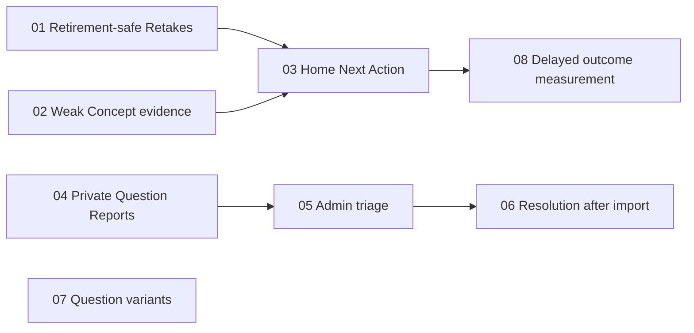

# Implementation order: guidance from practice evidence

This document covers the eight next-release ticket drafts. Each ticket now has its own local file so it can be implemented from a concrete path. GitHub issue publication remains pending breakdown approval; these are local drafts, not GitHub issue numbers. This document provides commands to run later and does not start implementation.

## Context and commands

Work from `D:\Job Hunt`. Read [the agreed specification](next-release-spec.md), [CONTEXT.md](../CONTEXT.md), and [ADR-0009](adr/0009-retirement-removes-pending-retake-blockers.md). Full ticket acceptance criteria live in the linked files below; the ordering document does not replace them.

For one ticket, paste its **Codex chat command** into a new Codex chat in this project, or run its **PowerShell command** to open an interactive Codex CLI session. `$implement` names the installed skill; it is part of the prompt. PowerShell commands deliberately single-quote the prompt so PowerShell preserves the dollar sign.

The implementation prompt scopes work to one ticket, verifies blockers, asks for relevant tests and review, and preserves unrelated changes. The installed implement skill commits completed work; review those commits before release. Complete blockers and make their tested changes available in the checkout before starting a dependent ticket. Check current skill instructions and repository guidance at execution time.

## Recommended order for one developer

**01 → 02 → 07 → 03 → 04 → 05 → 06 → 08**

Ticket 07 is early to strengthen practice content; it is not a prerequisite for software implementation. The earlier version-1 implementation-order document describes a different release.

| Step | Ticket draft | Blocked by | Completion demo |
| --- | --- | --- | --- |
| 1 | [01 · Prevent retired Questions from blocking Lesson completion](<D:/Job Hunt/.scratch/practice-guidance/issues/01-retirement-safe-retakes.md>) | None | A Learner never has to answer retired content to finish an already-passed Lesson Quiz, and can see why a pending Retake was replaced or waived. |
| 2 | [02 · Show Weak Concept evidence on each Stack page](<D:/Job Hunt/.scratch/practice-guidance/issues/02-weak-concept-evidence.md>) | None | A Learner can inspect each active Stack's Concept evidence, identify recent weaknesses and recovery, and open the relevant Lesson. |
| 3 | [07 · Add varied Questions to a bounded set of thin Concepts](<D:/Job Hunt/.scratch/practice-guidance/issues/07-thin-concept-question-variants.md>) | None | Learners get additional sourced scenario variants through existing Lesson Quizzes, Retakes and Review for a small, auditable content batch. |
| 4 | [03 · Recommend one useful Next Action on Home](<D:/Job Hunt/.scratch/practice-guidance/issues/03-home-next-action.md>) | 01, 02 | After a Daily Challenge, a Learner sees one optional, actionable recommendation and up to three Weak Concepts across Active Stacks. |
| 5 | [04 · Let Learners submit and track private Question Reports](<D:/Job Hunt/.scratch/practice-guidance/issues/04-private-question-reports.md>) | None | After answering an active Question, a Learner can report a defect, edit an Open report and inspect their own report status. |
| 6 | [05 · Let Admins review Question Reports grouped by Question](<D:/Job Hunt/.scratch/practice-guidance/issues/05-admin-report-triage.md>) | 04 | An Admin can inspect corroborating reports, accept a defect awaiting publication or close a report with an explanation, and the reporter sees the decision. |
| 7 | [06 · Resolve accepted Question Reports when their correction is imported](<D:/Job Hunt/.scratch/practice-guidance/issues/06-report-resolution-on-import.md>) | 05 | A reporter sees Resolved only after the correction associated with their accepted Question Report has reached the imported app content. |
| 8 | [08 · Measure delayed variant performance after targeted practice](<D:/Job Hunt/.scratch/practice-guidance/issues/08-delayed-practice-outcomes.md>) | 03 | An Admin can inspect whether Learners answer distinct, previously unrecorded variants correctly 7–14 Days after targeted practice, with denominators and limitations. |

## Commands per ticket

### Step 1: ticket 01

**Ticket path:** [D:\Job Hunt\.scratch\practice-guidance\issues\01-retirement-safe-retakes.md](<D:/Job Hunt/.scratch/practice-guidance/issues/01-retirement-safe-retakes.md>)

**Blocked by:** None.

Codex chat command:

```text
$implement Implement only ticket 01 from "D:\Job Hunt\.scratch\practice-guidance\issues\01-retirement-safe-retakes.md". Read "D:\Job Hunt\docs\next-release-spec.md", CONTEXT.md and relevant ADRs. Verify its blockers are complete. Meet all acceptance criteria, run appropriate checks, review the change, and commit only work for this ticket. Preserve unrelated changes.
```

PowerShell command:

```powershell
codex -C 'D:\Job Hunt' '$implement Implement only ticket 01 from "D:\Job Hunt\.scratch\practice-guidance\issues\01-retirement-safe-retakes.md". Read "D:\Job Hunt\docs\next-release-spec.md", CONTEXT.md and relevant ADRs. Verify its blockers are complete. Meet all acceptance criteria, run appropriate checks, review the change, and commit only work for this ticket. Preserve unrelated changes.'
```

### Step 2: ticket 02

**Ticket path:** [D:\Job Hunt\.scratch\practice-guidance\issues\02-weak-concept-evidence.md](<D:/Job Hunt/.scratch/practice-guidance/issues/02-weak-concept-evidence.md>)

**Blocked by:** None.

Codex chat command:

```text
$implement Implement only ticket 02 from "D:\Job Hunt\.scratch\practice-guidance\issues\02-weak-concept-evidence.md". Read "D:\Job Hunt\docs\next-release-spec.md", CONTEXT.md and relevant ADRs. Verify its blockers are complete. Meet all acceptance criteria, run appropriate checks, review the change, and commit only work for this ticket. Preserve unrelated changes.
```

PowerShell command:

```powershell
codex -C 'D:\Job Hunt' '$implement Implement only ticket 02 from "D:\Job Hunt\.scratch\practice-guidance\issues\02-weak-concept-evidence.md". Read "D:\Job Hunt\docs\next-release-spec.md", CONTEXT.md and relevant ADRs. Verify its blockers are complete. Meet all acceptance criteria, run appropriate checks, review the change, and commit only work for this ticket. Preserve unrelated changes.'
```

### Step 3: ticket 07

**Ticket path:** [D:\Job Hunt\.scratch\practice-guidance\issues\07-thin-concept-question-variants.md](<D:/Job Hunt/.scratch/practice-guidance/issues/07-thin-concept-question-variants.md>)

**Blocked by:** None.

Codex chat command:

```text
$implement Implement only ticket 07 from "D:\Job Hunt\.scratch\practice-guidance\issues\07-thin-concept-question-variants.md". Read "D:\Job Hunt\docs\next-release-spec.md", CONTEXT.md and relevant ADRs. Verify its blockers are complete. Meet all acceptance criteria, run appropriate checks, review the change, and commit only work for this ticket. Preserve unrelated changes.
```

PowerShell command:

```powershell
codex -C 'D:\Job Hunt' '$implement Implement only ticket 07 from "D:\Job Hunt\.scratch\practice-guidance\issues\07-thin-concept-question-variants.md". Read "D:\Job Hunt\docs\next-release-spec.md", CONTEXT.md and relevant ADRs. Verify its blockers are complete. Meet all acceptance criteria, run appropriate checks, review the change, and commit only work for this ticket. Preserve unrelated changes.'
```

### Step 4: ticket 03

**Ticket path:** [D:\Job Hunt\.scratch\practice-guidance\issues\03-home-next-action.md](<D:/Job Hunt/.scratch/practice-guidance/issues/03-home-next-action.md>)

**Blocked by:** 01, 02.

Codex chat command:

```text
$implement Implement only ticket 03 from "D:\Job Hunt\.scratch\practice-guidance\issues\03-home-next-action.md". Read "D:\Job Hunt\docs\next-release-spec.md", CONTEXT.md and relevant ADRs. Verify its blockers are complete. Meet all acceptance criteria, run appropriate checks, review the change, and commit only work for this ticket. Preserve unrelated changes.
```

PowerShell command:

```powershell
codex -C 'D:\Job Hunt' '$implement Implement only ticket 03 from "D:\Job Hunt\.scratch\practice-guidance\issues\03-home-next-action.md". Read "D:\Job Hunt\docs\next-release-spec.md", CONTEXT.md and relevant ADRs. Verify its blockers are complete. Meet all acceptance criteria, run appropriate checks, review the change, and commit only work for this ticket. Preserve unrelated changes.'
```

### Step 5: ticket 04

**Ticket path:** [D:\Job Hunt\.scratch\practice-guidance\issues\04-private-question-reports.md](<D:/Job Hunt/.scratch/practice-guidance/issues/04-private-question-reports.md>)

**Blocked by:** None.

Codex chat command:

```text
$implement Implement only ticket 04 from "D:\Job Hunt\.scratch\practice-guidance\issues\04-private-question-reports.md". Read "D:\Job Hunt\docs\next-release-spec.md", CONTEXT.md and relevant ADRs. Verify its blockers are complete. Meet all acceptance criteria, run appropriate checks, review the change, and commit only work for this ticket. Preserve unrelated changes.
```

PowerShell command:

```powershell
codex -C 'D:\Job Hunt' '$implement Implement only ticket 04 from "D:\Job Hunt\.scratch\practice-guidance\issues\04-private-question-reports.md". Read "D:\Job Hunt\docs\next-release-spec.md", CONTEXT.md and relevant ADRs. Verify its blockers are complete. Meet all acceptance criteria, run appropriate checks, review the change, and commit only work for this ticket. Preserve unrelated changes.'
```

### Step 6: ticket 05

**Ticket path:** [D:\Job Hunt\.scratch\practice-guidance\issues\05-admin-report-triage.md](<D:/Job Hunt/.scratch/practice-guidance/issues/05-admin-report-triage.md>)

**Blocked by:** 04.

Codex chat command:

```text
$implement Implement only ticket 05 from "D:\Job Hunt\.scratch\practice-guidance\issues\05-admin-report-triage.md". Read "D:\Job Hunt\docs\next-release-spec.md", CONTEXT.md and relevant ADRs. Verify its blockers are complete. Meet all acceptance criteria, run appropriate checks, review the change, and commit only work for this ticket. Preserve unrelated changes.
```

PowerShell command:

```powershell
codex -C 'D:\Job Hunt' '$implement Implement only ticket 05 from "D:\Job Hunt\.scratch\practice-guidance\issues\05-admin-report-triage.md". Read "D:\Job Hunt\docs\next-release-spec.md", CONTEXT.md and relevant ADRs. Verify its blockers are complete. Meet all acceptance criteria, run appropriate checks, review the change, and commit only work for this ticket. Preserve unrelated changes.'
```

### Step 7: ticket 06

**Ticket path:** [D:\Job Hunt\.scratch\practice-guidance\issues\06-report-resolution-on-import.md](<D:/Job Hunt/.scratch/practice-guidance/issues/06-report-resolution-on-import.md>)

**Blocked by:** 05.

Codex chat command:

```text
$implement Implement only ticket 06 from "D:\Job Hunt\.scratch\practice-guidance\issues\06-report-resolution-on-import.md". Read "D:\Job Hunt\docs\next-release-spec.md", CONTEXT.md and relevant ADRs. Verify its blockers are complete. Meet all acceptance criteria, run appropriate checks, review the change, and commit only work for this ticket. Preserve unrelated changes.
```

PowerShell command:

```powershell
codex -C 'D:\Job Hunt' '$implement Implement only ticket 06 from "D:\Job Hunt\.scratch\practice-guidance\issues\06-report-resolution-on-import.md". Read "D:\Job Hunt\docs\next-release-spec.md", CONTEXT.md and relevant ADRs. Verify its blockers are complete. Meet all acceptance criteria, run appropriate checks, review the change, and commit only work for this ticket. Preserve unrelated changes.'
```

### Step 8: ticket 08

**Ticket path:** [D:\Job Hunt\.scratch\practice-guidance\issues\08-delayed-practice-outcomes.md](<D:/Job Hunt/.scratch/practice-guidance/issues/08-delayed-practice-outcomes.md>)

**Blocked by:** 03.

Codex chat command:

```text
$implement Implement only ticket 08 from "D:\Job Hunt\.scratch\practice-guidance\issues\08-delayed-practice-outcomes.md". Read "D:\Job Hunt\docs\next-release-spec.md", CONTEXT.md and relevant ADRs. Verify its blockers are complete. Meet all acceptance criteria, run appropriate checks, review the change, and commit only work for this ticket. Preserve unrelated changes.
```

PowerShell command:

```powershell
codex -C 'D:\Job Hunt' '$implement Implement only ticket 08 from "D:\Job Hunt\.scratch\practice-guidance\issues\08-delayed-practice-outcomes.md". Read "D:\Job Hunt\docs\next-release-spec.md", CONTEXT.md and relevant ADRs. Verify its blockers are complete. Meet all acceptance criteria, run appropriate checks, review the change, and commit only work for this ticket. Preserve unrelated changes.'
```

## Independent lanes

The dependency graph permits these lanes once each prerequisite is complete:

- Learning guidance: 01 and 02 → 03 → 08.
- Question Reports: 04 → 05 → 06.
- Content enrichment: 07, independently.

Independent tickets can run concurrently in separate worktrees, with completed changes integrated before dependents start. Shared schema, routing, or component changes can still require coordination even without a product dependency. Sequential execution is the default suggested above.



## Completion checks

Before moving to a dependent ticket, ensure its blockers satisfy their acceptance criteria and relevant tests, including the required schema/content checks for content changes. After all eight tickets, verify the complete release against the specification: evidence boundaries, recommendation eligibility, report privacy, import-linked resolution, retirement waivers and delayed-measurement denominators. Run the appropriate repository checks and review the integrated change before publishing or deploying.

Keep implementation progress in ticket outcomes or the tracker; the draft status does not imply approval, implementation or release. If GitHub tickets are published later, add their real links and identifiers here while retaining local context pointers.

